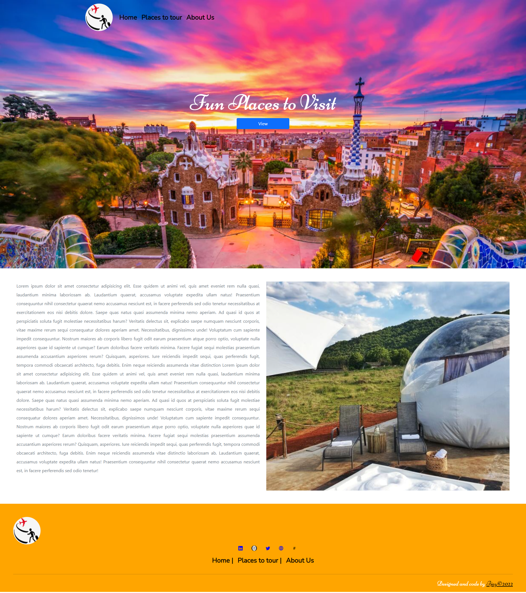

  
  <h1>Tour Web App</h1>

<!-- TABLE OF CONTENTS -->

  
Table of Contents

  <ol>
    <li>
      <a href="#about-the-project">About The Project</a>
      <ul>
          <li><a href="#built-with">Built With</a></li>
          <li><a href="#getting-started">Getting Started</a></li>
          <li><a href="#Available Script">Available Script</a></li>
         </ul>
    </li>      
  </ol>

## About The Project

<!-- [![Product Name Screen Shot][product-screenshot]](https://example.com) -->

Repo_name: 

project_title: Tour Web App

project_description: This website has a landing page and allows you to navigate to a section that shows places to visit for relaxation.

(<a href="#top">back to top</a>)

### Built With

* [React](https://reactjs.org/)
* [React-bootstrap](https://react-bootstrap.github.io/)

(<a href="#top">back to top</a>)

## Getting Started
This project was bootstrapped with [Create React App](https://github.com/facebook/create-react-app).

To get a local copy up and running follow these simple example steps:
## Available Script

In the project directory, you can run:

 ### `npm start`

Runs the app in the development mode.\
Open [http://localhost:3000](http://localhost:3000) to view it in your browser.

The page will reload when you make changes.\
You may also see any lint errors in the console.

(<a href="#top">back to top</a>)

